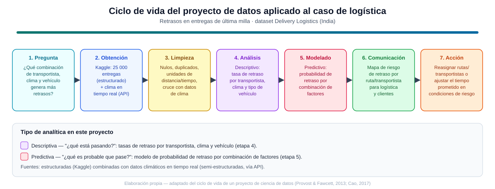

# Ciencia de Datos · Semana 1 — Encuadre de un proyecto de datos

**Programa:** Ingeniería Industrial · **Asignatura:** Ciencia de Datos
**Unidad:** 1 · Fundamentos de Ciencia de Datos y Big Data · **Semana / Corte:** 1 · Corte 1
**Tema:** Logística — Retrasos en entregas de última milla

---

## 1. Pregunta de negocio

> ¿Qué combinación de transportista, condición climática y tipo de vehículo genera más retrasos en las entregas de última milla, y es posible anticipar esos retrasos antes de que ocurran?

Esta pregunta es clara y accionable porque delimita las variables de interés (transportista, clima, vehículo), el fenómeno a explicar (el retraso) y el horizonte de uso (anticipación), en lugar de plantear una exploración abierta sin foco de decisión.

## 2. Datos y fuentes

| Aspecto | Detalle |
|---|---|
| Dataset base | [Delivery Logistics Dataset (India – Multi-Partner)](https://www.kaggle.com/datasets/kundanbedmutha/delivery-logistics-dataset-india-multi-partner) — Kaggle |
| Volumen | 25 000 registros de entregas |
| Variables clave | Partner logístico (transportista), distancia recorrida, condición climática, tipo de paquete/vehículo, tiempo estimado vs. tiempo real, estado final de la entrega (a tiempo / retrasada) |
| Naturaleza | **Estructurados** (tabla con columnas bien definidas, tipo CSV) |
| Enriquecimiento posible | Datos climáticos en tiempo real obtenidos vía API meteorológica pública, para contrastar el clima reportado en el histórico con condiciones actuales de una ruta |
| Naturaleza del enriquecimiento | **Semi-estructurados** (respuestas JSON de una API), lo que exigiría un paso adicional de integración/normalización antes del análisis conjunto |

La combinación de una fuente estructurada (el histórico de Kaggle) con una semi-estructurada (clima en tiempo real) es intencional: el histórico permite describir y entrenar un modelo, mientras que el flujo en tiempo real es lo que haría operativa la anticipación de retrasos en producción.

## 3. Decisión esperada

Con los resultados del análisis, el área de logística podría tomar dos tipos de acción:

1. **Reasignar rutas o transportistas** cuando la combinación prevista de clima y tipo de vehículo eleve significativamente la probabilidad de retraso para un transportista específico.
2. **Ajustar el tiempo de entrega prometido al cliente** (de forma proactiva, no reactiva) en condiciones identificadas como de alto riesgo, evitando incumplimientos y gestionando mejor la expectativa del cliente.

Esta decisión es concreta porque especifica quién actúa (logística/operaciones), sobre qué (ruta, transportista o promesa de tiempo) y bajo qué condición (riesgo detectado por el modelo).

## 4. Tipo de analítica

El proyecto combina dos tipos de analítica, coherentes con la clasificación estándar del campo (descriptiva, predictiva, prescriptiva y diagnóstica; ver §5.2):

- **Descriptiva** — responde *"¿qué está pasando?"*: cuantifica las tasas de retraso históricas cruzando transportista × clima × tipo de vehículo, para identificar los patrones y combinaciones más problemáticas.
- **Predictiva** — responde *"¿qué es probable que pase?"*: a partir de esos patrones, se entrena un modelo de clasificación que estima la **probabilidad de retraso** de una entrega futura dado su transportista, clima esperado y vehículo asignado.

No se plantea analítica prescriptiva en esta etapa (aunque la decisión del punto 3 apunta naturalmente hacia ella en una fase posterior del curso).

---

## 5. Marco de referencia y conceptos

### 5.1 Ciencia de datos como campo interdisciplinario

La ciencia de datos se define como un campo interdisciplinario que combina estadística, programación, aprendizaje automático y conocimiento del dominio para **extraer valor y conocimiento a partir de datos —estructurados y no estructurados— y apoyar la toma de decisiones** (material de la asignatura, CORHUILA, 2026). Provost y Fawcett (2013) formalizan esta idea distinguiendo la ciencia de datos, como disciplina de principios y técnicas, del *big data*, como la infraestructura y el volumen de datos sobre los que esa disciplina opera; para estos autores, el valor de la ciencia de datos está precisamente en convertir datos en decisiones mejor informadas, que es el mismo criterio que organiza este trabajo (pregunta → datos → decisión).

En este proyecto, esa interdisciplinariedad se ve reflejada así: la **estadística** describe las tasas de retraso observadas; la **programación** permite procesar 25 000 registros y consultar una API climática; el **aprendizaje automático** genera el modelo predictivo de retraso; y el **conocimiento del dominio logístico** es lo que permite interpretar por qué ciertas combinaciones (por ejemplo, motocicleta + lluvia + un transportista específico) elevan el riesgo, y traducir ese hallazgo en una decisión operativa.

### 5.2 Jerarquía dato → información → conocimiento, y tipos de analítica

Siguiendo el material de la asignatura (CORHUILA, 2026), es útil distinguir tres niveles: un **dato** es un hecho aislado (p. ej., "38 °C" o "lluvia moderada"); la **información** es el dato puesto en contexto (p. ej., "el envío 4521, asignado a la motocicleta del transportista B, salió bajo lluvia moderada"); y el **conocimiento** es el patrón accionable que emerge del análisis (p. ej., "los envíos en motocicleta bajo lluvia con el transportista B tienen una tasa de retraso muy superior al promedio"). El proyecto aquí planteado recorre justamente ese tránsito: parte de datos crudos de Kaggle, los convierte en información al cruzarlos con clima y vehículo, y aspira a producir conocimiento accionable en forma de reglas o probabilidades de retraso.

Cao (2017), en una revisión exhaustiva del campo, ubica la analítica dentro de un ciclo de vida de ciencia de datos que va del dato a la decisión, y clasifica las tareas analíticas según la pregunta que responden: la analítica **descriptiva** resume qué ha ocurrido, la **diagnóstica** explica por qué ocurrió, la **predictiva** estima qué es probable que ocurra, y la **prescriptiva** recomienda qué hacer al respecto. Este trabajo se ubica explícitamente en las dos primeras de esas cuatro categorías orientadas a la acción (descriptiva y predictiva), como se detalló en la sección 4.

### 5.3 Predicción de retrasos en logística de última milla

La pregunta de negocio de este trabajo no es solo un ejercicio académico: se inscribe en una línea de investigación activa sobre predicción de retrasos en cadenas de suministro y logística de última milla, donde variables como el clima, el tipo de vehículo y el transportista asignado se han identificado como factores determinantes del cumplimiento de los tiempos de entrega prometidos. Küp et al. (2024) muestran, mediante técnicas de aprendizaje automático aplicadas a datos reales de cadenas de suministro, que es posible anticipar retrasos de entrega con antelación suficiente para intervenir operativamente —reasignando recursos o ajustando promesas de tiempo—, que es exactamente el tipo de decisión descrita en la sección 3 de este documento.

### 5.4 Diagrama del ciclo de vida del proyecto

El siguiente diagrama (`ciclo-vida-proyecto-datos.svg`, incluido junto a este documento) resume cómo las siete etapas típicas de un proyecto de ciencia de datos —pregunta, obtención, limpieza, análisis, modelado, comunicación y acción— se instancian en el caso concreto de retrasos de última milla, señalando además en qué etapas se realiza la analítica descriptiva y en cuáles la predictiva.

---

## 6. Referencias

- CORHUILA. (2026). *Ciencia de Datos · Semana 1 · Introducción a la ciencia de datos* [Material de curso, OVA]. Corporación Universitaria del Huila. https://code-corhuila.github.io/ova-web/2026-B/ciencia-datos/01-week/01-session/
- Cao, L. (2017). Data science: A comprehensive overview. *ACM Computing Surveys, 50*(3), Artículo 43. https://doi.org/10.1145/3076253
- Küp, B. Ü., Küp, E. T., Koçak, G., Yücekaya, A. D., & Hekimoğlu, M. (2024). *Real-time prediction of delivery delay in supply chains using machine learning approaches* [Preprint]. SSRN. https://papers.ssrn.com/sol3/papers.cfm?abstract_id=5062672
- Provost, F., & Fawcett, T. (2013). Data science and its relationship to big data and data-driven decision making. *Big Data, 1*(1), 51–59. https://doi.org/10.1089/big.2013.1508
