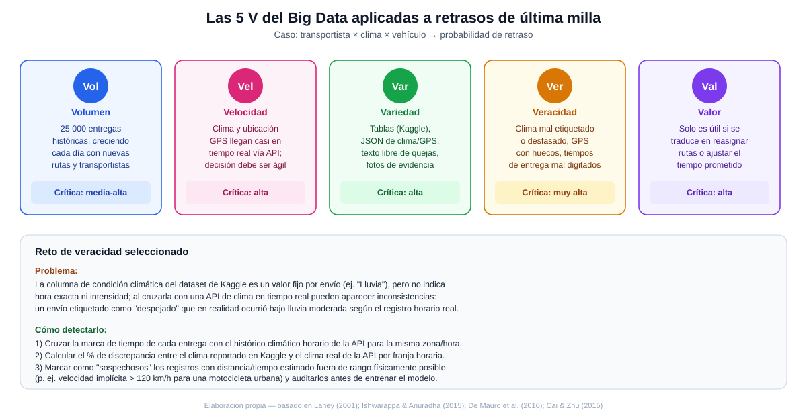

# Ciencia de Datos · Semana 2 — Clasifica datos y las V del Big Data

**Programa:** Ingeniería Industrial · **Asignatura:** Ciencia de Datos
**Unidad:** 1 · Fundamentos de Ciencia de Datos y Big Data · **Semana / Corte:** 2 · Corte 1
**Tema:** Logística — Retrasos en entregas de última milla (continuación de la Semana 1)

---

## 1. Fuentes de datos del caso y su clasificación

El caso de retrasos en última milla no depende de una sola fuente: para poder describir y predecir el retraso hace falta combinar el histórico de entregas con datos operativos que se generan en tiempo real y con evidencia cualitativa del servicio. A continuación se listan **seis fuentes de datos**, clasificadas según su estructura.

| # | Fuente de datos | Ejemplo concreto | Tipo | Justificación |
|---|---|---|---|---|
| 1 | Dataset histórico de entregas | [Delivery Logistics Dataset – Kaggle](https://www.kaggle.com/datasets/kundanbedmutha/delivery-logistics-dataset-india-multi-partner): transportista, distancia, tiempo estimado/real, estado | **Estructurado** | Tabla con filas y columnas fijas (CSV), esquema predefinido, propia de una base de datos relacional |
| 2 | API de clima en tiempo real | Respuesta JSON de un servicio meteorológico (temperatura, precipitación, viento por hora/zona) | **Semiestructurado** | Tiene etiquetas (`{"temp":..., "condicion":...}`) pero el esquema puede variar entre proveedores y no está normalizado en una tabla |
| 3 | Telemetría GPS del vehículo | Flujo de eventos de ubicación y velocidad enviados por la app del transportista o el dispositivo del vehículo | **Semiestructurado** | Registros tipo log/JSON con marca de tiempo, sin una tabla relacional fija; llega como flujo continuo (streaming) |
| 4 | Sistema ERP / facturación del operador logístico | Tablas de órdenes de envío, costos, zonas de cobertura, turnos del conductor | **Estructurado** | Base de datos transaccional con relaciones definidas (cliente–pedido–transportista) |
| 5 | Encuestas y comentarios de clientes post-entrega | Campo de texto libre: *"el paquete llegó mojado y con dos horas de retraso"* | **No estructurado** | Texto en lenguaje natural, sin esquema ni campos delimitados, requiere procesamiento de lenguaje natural para explotarse |
| 6 | Fotos de evidencia de entrega (prueba de entrega / POD) | Imagen tomada por el transportista al momento de entregar el paquete | **No estructurado** | Archivo binario (imagen); no tiene una estructura tabular ni etiquetas de campo asociadas por sí solo |

Esta clasificación en tres categorías (estructurado, semiestructurado y no estructurado) es la que propone el material de la asignatura (CORHUILA, 2026) y coincide con la usada en la literatura de big data para distinguir el nivel de esquema previo que tiene cada fuente antes de poder analizarse (Ishwarappa & Anuradha, 2015).

## 2. V del Big Data críticas en este caso

De las cinco V clásicas (volumen, velocidad, variedad, veracidad, valor), las **cuatro más críticas** para este proyecto son:

- **Volumen** — el histórico de 25 000 entregas ya es considerable para un análisis manual, y crece cada día con nuevas rutas, transportistas y zonas de cobertura; cualquier solución debe poder escalar sin rehacerse por cada lote nuevo de datos.
- **Velocidad** — el valor de anticipar un retraso depende de tener el clima y la ubicación GPS *casi* en tiempo real (fuentes 2 y 3): una alerta de riesgo climático que llega después de que el vehículo ya salió no permite reasignar nada, así que el dato pierde utilidad si no se procesa con baja latencia.
- **Variedad** — el caso combina tablas relacionales (fuentes 1 y 4), datos semiestructurados en streaming (fuentes 2 y 3) y datos no estructurados (fuentes 5 y 6); un análisis completo de causas de retraso eventualmente necesitará técnicas distintas para cada tipo (SQL, procesamiento de streams, NLP, visión por computador).
- **Veracidad** — es la más crítica de todas para la decisión de negocio: si el clima o la distancia real están mal registrados, el modelo predictivo aprenderá patrones falsos y las decisiones de reasignación de rutas o ajuste de tiempos prometidos se tomarán sobre una base equivocada (ver sección 3).

La **valor** también está presente (el objetivo final es una decisión operativa concreta, como se definió en la Semana 1), pero se considera menos crítica en esta etapa temprana porque todavía no hay un modelo desplegado que dependa de ella; se volverá central cuando el proyecto pase de la fase exploratoria a producción.

## 3. Reto de veracidad y cómo detectarlo

**Problema identificado:** la condición climática en el dataset de Kaggle está registrada como una categoría fija por envío (por ejemplo, "Lluvia" o "Despejado"), sin hora exacta ni intensidad. Al combinarla con una API de clima en tiempo real para enriquecer el análisis (como se planteó en la Semana 1), pueden aparecer **inconsistencias de veracidad**: un envío etiquetado como "despejado" que, según el registro horario real de la API, ocurrió durante un episodio de lluvia moderada. Esto contamina tanto el análisis descriptivo (tasas de retraso mal atribuidas al clima) como el modelo predictivo (aprendería una relación clima–retraso distorsionada).

**Cómo se detectaría:**

1. Cruzar la marca de tiempo de cada entrega con el histórico climático horario de la API para la misma zona geográfica y comparar la etiqueta de Kaggle contra el valor real reportado.
2. Calcular el porcentaje de discrepancia entre el clima etiquetado y el clima real por franja horaria y por zona, para dimensionar qué tan extendido está el problema.
3. Aplicar una regla de validación física simple sobre distancia y tiempo (por ejemplo, marcar como sospechoso cualquier registro donde la velocidad implícita —distancia entre tiempo estimado— supere un umbral razonable para el tipo de vehículo, como 120 km/h para una motocicleta urbana) y auditar manualmente esos casos antes de usarlos para entrenar el modelo.

Este tipo de verificación cruzada es consistente con las prácticas de evaluación de calidad de datos descritas por Cai y Zhu (2015), quienes señalan que en contextos de big data la veracidad no puede darse por sentada y requiere mecanismos explícitos de validación cruzada entre fuentes antes del análisis.

---

## 4. Marco de referencia y conceptos

### 4.1 Origen y evolución del concepto de las V

El marco de las V del big data se originó con Laney (2001), quien —en una nota de investigación para META Group (hoy Gartner)— identificó tres dimensiones de desafío para la gestión de datos: **volumen**, **velocidad** y **variedad**. Con el tiempo, la comunidad académica amplió este modelo a cinco dimensiones incorporando **veracidad** y **valor**, para capturar no solo el reto técnico de manejar los datos sino también su calidad y su utilidad real para la toma de decisiones (Ishwarappa & Anuradha, 2015). Este trabajo usa el modelo de cinco V porque el caso de logística no solo enfrenta un problema de escala (volumen/velocidad/variedad), sino también, y de forma más crítica, un problema de confiabilidad de los datos climáticos y de ubicación (veracidad) y de utilidad para una decisión concreta (valor).

### 4.2 Una definición formal de big data

De Mauro, Greco y Grimaldi (2016) realizan una revisión sistemática de las definiciones de big data existentes en la literatura y proponen una definición formal: big data es "el activo de información caracterizado por un volumen, velocidad y variedad tan altos que requiere tecnología y métodos analíticos específicos para transformarlo en valor". Esta definición es útil para el caso de última milla porque deja claro que no basta con tener muchos datos (volumen): el reto real aparece cuando, además del volumen, hay que procesar datos que cambian rápido (velocidad, como el clima y el GPS) y que llegan en formatos heterogéneos (variedad, como texto de quejas o fotos de entrega), y todo eso solo se justifica si termina convirtiéndose en una decisión operativa (valor), que es precisamente el criterio con el que se evaluaron las V en la sección 2.

### 4.3 Veracidad y calidad de datos como reto central

Cai y Zhu (2015) argumentan que, de las V del big data, la veracidad (calidad de los datos) es la dimensión más subestimada en la práctica, y proponen un marco de evaluación de calidad basado en dimensiones como precisión, completitud, consistencia y oportunidad (*timeliness*) de los datos. Aplicado a este caso, el reto de veracidad descrito en la sección 3 —la discrepancia entre el clima etiquetado en el histórico y el clima real capturado por una API— es exactamente un problema de **consistencia** y **oportunidad** en los términos de estos autores: el dato existe, pero no coincide entre fuentes ni refleja el momento exacto de la entrega, lo cual, si no se detecta, se propaga como error hacia el análisis y el modelo predictivo planteados en la Semana 1.

### 4.4 Diagrama de las 5V aplicadas al caso

El diagrama `5v-big-data-logistica.svg` (incluido junto a este documento) resume, para cada una de las cinco V, cómo se manifiesta en el caso de última milla, su nivel de criticidad y el reto de veracidad concreto identificado en la sección 3.

---

## 5. Verificación frente a la rúbrica

| Criterio de la rúbrica | Cómo se cumple en este documento |
|---|---|
| Clasificación de fuentes (6+, correcta) | Tabla de la sección 1 con **6 fuentes** distintas, cubriendo los tres tipos (estructurado, semiestructurado, no estructurado) con justificación individual |
| V relevantes justificadas (claras) | Sección 2 explica, con argumento propio del caso, por qué volumen, velocidad, variedad y veracidad son críticas, y por qué valor lo es en menor grado en esta etapa |
| Reto de veracidad (concreto) | Sección 3 describe un problema específico (discrepancia clima etiquetado vs. clima real por hora/zona) y **tres pasos concretos** para detectarlo, no una afirmación genérica |

---

## 6. Referencias

- CORHUILA. (2026). *Ciencia de Datos · Semana 2 · Fundamentos de Big Data* [Material de curso, OVA]. Corporación Universitaria del Huila. https://code-corhuila.github.io/ova-web/2026-B/ciencia-datos/02-week/01-session/
- Cai, L., & Zhu, Y. (2015). The challenges of data quality and data quality assessment in the big data era. *Data Science Journal, 14*, Artículo 2. https://doi.org/10.5334/dsj-2015-002
- De Mauro, A., Greco, M., & Grimaldi, M. (2016). A formal definition of Big Data based on its essential features. *Library Review, 65*(3), 122–135. https://doi.org/10.1108/LR-06-2015-0061
- Ishwarappa, & Anuradha, J. (2015). A brief introduction on Big Data 5Vs characteristics and Hadoop technology. *Procedia Computer Science, 48*, 319–324. https://doi.org/10.1016/j.procs.2015.04.188
- Laney, D. (2001). *3D data management: Controlling data volume, velocity and variety* (META Group Research Note, Vol. 6, No. 70). META Group.
