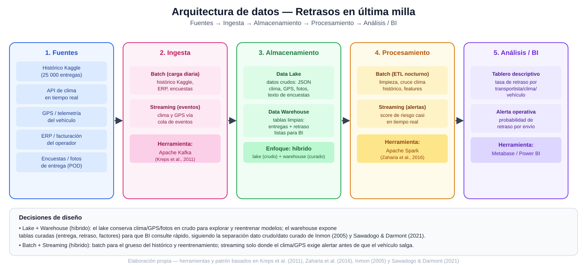

# Ciencia de Datos · Semana 3 — Diseña una arquitectura de datos

**Programa:** Ingeniería Industrial · **Asignatura:** Ciencia de Datos
**Unidad:** 1 · Fundamentos de Ciencia de Datos y Big Data · **Semana / Corte:** 3 · Corte 1
**Tema:** Logística — Retrasos en entregas de última milla (continuación de las Semanas 1 y 2)

---

## 1. Arquitectura del flujo completo (fuentes → ingesta → almacenamiento → procesamiento → análisis/BI)

El diagrama `arquitectura-datos-logistica.svg` (incluido junto a este documento) muestra el flujo completo de extremo a extremo para el caso de retrasos en última milla. A continuación se incluye también la versión en ASCII, para que el flujo quede legible directamente en el repositorio de GitHub sin depender de la imagen:

```
[FUENTES]                     [INGESTA]                [ALMACENAMIENTO]              [PROCESAMIENTO]              [ANÁLISIS / BI]
──────────                    ──────────                ────────────────              ────────────────              ───────────────
Kaggle (histórico) ─────┐                                                          
API de clima (tiempo   ─┼──►  Batch (diario:        ──►  DATA LAKE            ──►   Batch (ETL nocturno:   ──►   Tablero descriptivo
  real)                 │      Kaggle, ERP,               (crudo: JSON clima/            limpieza, cruce           (tasa de retraso por
GPS / telemetría        │      encuestas, fotos)            GPS, fotos, texto)            clima histórico,          transportista/clima/
  del vehículo          │                                                                 features)                 vehículo)
ERP / facturación      ─┤     Streaming (eventos:   ──►  DATA WAREHOUSE       ──►   Streaming (score de    ──►   Alerta operativa
  del operador          │      clima y GPS vía             (curado: tabla de            riesgo casi en             (probabilidad de
Encuestas / fotos      ─┘      cola de eventos)             entregas + retraso,          tiempo real)               retraso por envío)
  de entrega (POD)                                          lista para BI)

Herramienta candidata:        Apache Kafka             Lake + Warehouse             Apache Spark               Metabase / Power BI
```

## 2. Data lake o data warehouse — justificación

**Decisión: arquitectura híbrida (data lake + data warehouse), no uno solo.**

- Se necesita un **data lake** porque varias fuentes del caso llegan sin una estructura tabular fija y en su forma cruda: las respuestas JSON de la API de clima, los eventos de telemetría GPS, las fotos de evidencia de entrega y el texto libre de las encuestas de clientes (fuentes clasificadas como semiestructuradas/no estructuradas en la Semana 2). Guardarlas primero en un lake, sin forzarlas a un esquema, preserva la información original para poder reexplorarla o reentrenar el modelo predictivo más adelante sin perder detalle — este es justamente el argumento de Sawadogo y Darmont (2021), quienes describen el data lake como el repositorio adecuado para datos heterogéneos que aún no tienen un uso analítico único y definitivo.
- Se necesita también un **data warehouse** porque el objetivo final del proyecto (Semana 1) es que un tablero de BI muestre, de forma rápida y confiable, la tasa de retraso por transportista/clima/vehículo para apoyar una decisión operativa. Eso exige datos ya limpios, con un esquema fijo (entrega, transportista, clima, distancia, retraso sí/no) optimizado para consultas repetidas — la definición clásica de warehouse orientado a la toma de decisiones que propone Inmon (2005).
- En síntesis: el **lake** alimenta la exploración y el reentrenamiento del modelo con datos crudos; el **warehouse** alimenta el tablero operativo con datos curados. Ningún dato "vive" solo en un lugar: el lake es el origen y el warehouse es el destino curado para BI.

## 3. Batch o streaming — justificación

**Decisión: arquitectura híbrida (batch como base, streaming solo donde el negocio lo exige).**

- La mayor parte del flujo puede ser **batch**: el histórico de Kaggle, los datos del ERP y las encuestas no cambian minuto a minuto, así que procesarlos una vez al día (por ejemplo, de madrugada) es suficiente y más económico que mantener infraestructura de streaming para datos que no lo necesitan — exactamente el criterio de "no adoptar streaming innecesariamente" señalado en el material de la asignatura (CORHUILA, 2026).
- Se necesita **streaming** específicamente para el clima y el GPS del vehículo, porque el valor de negocio definido en la Semana 1 (reasignar rutas o ajustar el tiempo prometido) solo se cumple si la alerta de riesgo llega **antes** de que el vehículo salga o mientras va en camino; un batch nocturno llegaría demasiado tarde para esa decisión. Esta distinción —usar streaming únicamente cuando la inmediatez es indispensable para la acción, y no como default— es consistente con el principio de diseño de sistemas de mensajería de baja latencia descrito por Kreps et al. (2011) para casos donde el procesamiento de eventos en tiempo casi real habilita una acción oportuna.
- En síntesis: **batch para el grueso del histórico y el reentrenamiento del modelo, streaming acotado al clima y al GPS**, que son las dos variables que definen si hay tiempo de reaccionar.

## 4. Herramienta candidata por etapa

| Etapa | Herramienta candidata | Por qué |
|---|---|---|
| **Ingesta** | **Apache Kafka** | Kafka fue diseñado específicamente para ingerir grandes volúmenes de eventos (como el clima y el GPS en streaming) con baja latencia y alta tolerancia a fallos, desacoplando las fuentes del resto de la arquitectura (Kreps et al., 2011); además puede recibir tanto los eventos en tiempo real como las cargas batch (Kaggle, ERP) a través de conectores. |
| **Procesamiento** | **Apache Spark** | Spark permite procesar el mismo motor tanto en modo batch (ETL nocturno de limpieza y cruce con clima histórico) como en modo streaming (Structured Streaming, para el score de riesgo casi en tiempo real), lo cual evita mantener dos motores distintos para las dos necesidades del punto 3; Zaharia et al. (2016) lo describen como un motor unificado diseñado precisamente para cubrir ambos modelos de procesamiento sobre grandes volúmenes de datos. |
| **BI / Análisis** | **Metabase o Power BI** | Ambas herramientas se conectan directamente al data warehouse curado y permiten construir, sin código adicional, el tablero descriptivo de tasas de retraso por transportista/clima/vehículo y la vista de alertas operativas que el equipo de logística necesita consultar a diario para tomar la decisión definida en la Semana 1. |

---

## 5. Marco de referencia y conceptos

### 5.1 Lake vs. warehouse: dos repositorios con propósitos distintos

Inmon (2005), considerado uno de los fundadores del concepto de data warehouse, lo define como un repositorio de datos **orientado al tema, integrado, variable en el tiempo y no volátil**, construido específicamente para dar soporte a la toma de decisiones. Esta definición es la que sostiene la decisión del punto 2 de usar un warehouse para exponer datos ya curados al tablero de BI: el warehouse no está pensado para almacenar cualquier dato, sino para responder consultas analíticas repetidas de forma consistente y rápida.

Sawadogo y Darmont (2021), en una revisión sistemática de arquitecturas de data lake, señalan en cambio que el lake surge para resolver el problema opuesto: la necesidad de almacenar datos heterogéneos —estructurados, semiestructurados y no estructurados— en su formato original, sin forzar un esquema de antemano ("schema-on-read" en lugar de "schema-on-write"), preservando así opciones analíticas futuras que aún no se conocen del todo. Los autores también advierten, en línea con el material de la asignatura (CORHUILA, 2026), que un data lake sin gobierno ni catalogación de metadatos degenera fácilmente en lo que la literatura llama un "data swamp" (pantano de datos): datos acumulados pero imposibles de encontrar o confiar. Esa advertencia es la razón por la que este diseño no propone "solo un lake", sino un lake gobernado que alimenta un warehouse curado.

### 5.2 Ingesta y procesamiento distribuido para datos en movimiento

Kreps, Narkhede y Rao (2011) presentan Kafka como un sistema de mensajería distribuido diseñado para el procesamiento de flujos de eventos (logs) a gran escala con baja latencia, pensado originalmente para el caso de uso de LinkedIn de mover grandes volúmenes de eventos de actividad entre sistemas en tiempo casi real. Este diseño es el que se traslada al punto 4 de este documento como herramienta de ingesta: el clima y el GPS del caso de última milla son, en esencia, el mismo tipo de flujo continuo de eventos para el que Kafka fue concebido.

Zaharia et al. (2016) describen a Apache Spark como un motor de procesamiento distribuido "unificado": una misma abstracción de programación permite ejecutar cargas de trabajo batch, streaming (mediante micro-lotes o procesamiento continuo) y de aprendizaje automático sobre el mismo motor, evitando mantener sistemas separados para cada necesidad. Este argumento sustenta directamente la elección de Spark como herramienta de procesamiento en el punto 4, dado que el caso de última milla necesita, a la vez, procesamiento batch (limpieza del histórico) y streaming (score de riesgo en tiempo casi real).

### 5.3 Diagrama de la arquitectura

El diagrama `arquitectura-datos-logistica.svg` resume visualmente las cinco etapas del flujo, marcando en cada una la decisión batch/streaming y lake/warehouse, y la herramienta candidata correspondiente.



---

## 6. Verificación frente a la rúbrica

| Criterio de la rúbrica | Cómo se cumple en este documento |
|---|---|
| Arquitectura (flujo completo, clara y coherente) | Diagrama SVG + versión ASCII en la sección 1, con las cinco etapas completas (fuentes → ingesta → almacenamiento → procesamiento → análisis/BI) y las fuentes concretas del caso en cada una |
| Lake/warehouse + batch/streaming (justificado) | Secciones 2 y 3 justifican cada decisión con el razonamiento propio del caso (qué fuente necesita cada enfoque y por qué), no solo la elección final |
| Herramientas por etapa (pertinentes) | Tabla de la sección 4 con una herramienta por etapa (ingesta, procesamiento, BI) y el porqué de cada una, respaldado en las referencias académicas de la sección 5 |

---

## 7. Referencias

- CORHUILA. (2026). *Ciencia de Datos · Semana 3 · Ecosistema de Big Data* [Material de curso, OVA]. Corporación Universitaria del Huila. https://code-corhuila.github.io/ova-web/2026-B/ciencia-datos/03-week/01-session/
- Inmon, W. H. (2005). *Building the data warehouse* (4.ª ed.). Wiley.
- Kreps, J., Narkhede, N., & Rao, J. (2011). Kafka: A distributed messaging system for log processing. *Proceedings of the NetDB Workshop*, 1–7.
- Sawadogo, P., & Darmont, J. (2021). On data lake architectures and metadata management. *Journal of Intelligent Information Systems, 56*(1), 97–120. https://doi.org/10.1007/s10844-020-00608-7
- Zaharia, M., Xin, R. S., Wendell, P., Das, T., Armbrust, M., Dave, A., Meng, X., Rosen, J., Venkataraman, S., Franklin, M. J., Ghodsi, A., Gonzalez, J., Shenker, S., & Stoica, I. (2016). Apache Spark: A unified engine for big data processing. *Communications of the ACM, 59*(11), 56–65. https://doi.org/10.1145/2934664
