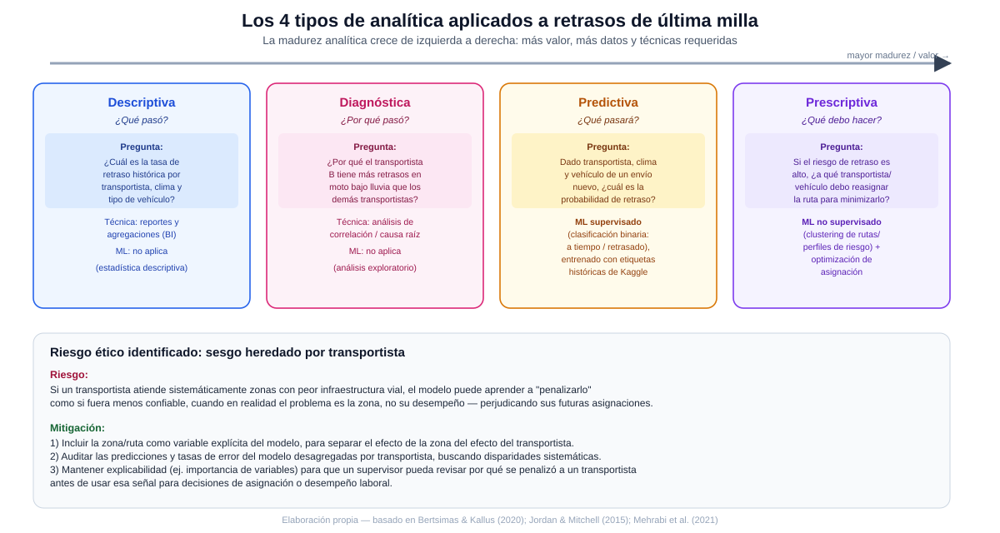

# Ciencia de Datos · Semana 4 — Tipos de analítica y ética

**Programa:** Ingeniería Industrial · **Asignatura:** Ciencia de Datos
**Unidad:** 1 · Fundamentos de Ciencia de Datos y Big Data · **Semana / Corte:** 4 · Corte 1
**Tema:** Logística — Retrasos en entregas de última milla (continuación de las Semanas 1 a 3)

---

## 1. Las 4 preguntas, una por tipo de analítica

| Tipo de analítica | Pregunta | Qué responde |
|---|---|---|
| **Descriptiva** | ¿Cuál es la tasa de retraso histórica por transportista, condición climática y tipo de vehículo en los últimos meses? | "¿Qué pasó?" — resume el comportamiento pasado de las 25 000 entregas del histórico |
| **Diagnóstica** | ¿Por qué el transportista con motocicletas presenta más retrasos bajo lluvia que los demás transportistas, incluso en distancias similares? | "¿Por qué pasó?" — busca la causa detrás del patrón detectado en la analítica descriptiva |
| **Predictiva** | Dado el transportista, el clima esperado y el vehículo asignado a un envío nuevo, ¿cuál es la probabilidad de que se retrase? | "¿Qué pasará?" — anticipa el resultado de una entrega antes de que ocurra |
| **Prescriptiva** | Si el modelo predice un riesgo alto de retraso para una ruta, ¿a qué transportista o tipo de vehículo conviene reasignarla para minimizar ese riesgo? | "¿Qué debo hacer?" — recomienda la acción concreta descrita como decisión esperada desde la Semana 1 |

Esta progresión sigue el orden de madurez analítica del material de la asignatura (CORHUILA, 2026): cada nivel se apoya en el anterior y exige más datos y técnicas — no tendría sentido intentar prescribir una reasignación de rutas (prescriptiva) sin antes poder predecir el riesgo (predictiva), ni predecir sin haber entendido primero qué combinaciones generan más retrasos (descriptiva y diagnóstica).

## 2. ML supervisado o no supervisado para predictiva y prescriptiva

- **Predictiva → ML supervisado.** La pregunta predictiva ("¿cuál es la probabilidad de que este envío se retrase?") es un problema de **clasificación binaria** (a tiempo / retrasado), y el dataset de Kaggle ya trae la etiqueta real de cada entrega pasada (si llegó a tiempo o no). Al existir esa variable objetivo conocida para entrenar el modelo, corresponde usar aprendizaje supervisado: el modelo aprende la relación entre las variables de entrada (transportista, clima, distancia, vehículo) y la etiqueta observada, exactamente la definición de aprendizaje supervisado como aprendizaje "a partir de ejemplos etiquetados" (Jordan & Mitchell, 2015).
- **Prescriptiva → ML no supervisado (como paso previo a la optimización).** La pregunta prescriptiva ("¿a qué transportista/vehículo reasignar la ruta?") no tiene una etiqueta histórica de "la reasignación correcta", porque nunca se ha observado qué habría pasado si se hubiera reasignado distinto (no existe un "ground truth" de la decisión óptima). Por eso, antes de prescribir, conviene usar aprendizaje **no supervisado** —por ejemplo, clustering de rutas o de perfiles de riesgo (transportista × zona × clima) para agrupar combinaciones con comportamiento similar sin partir de una etiqueta— y combinar esos grupos con una capa de optimización/reglas de negocio para producir la recomendación final. Esta distinción es consistente con el planteamiento de Bertsimas y Kallus (2020), quienes muestran que pasar de "predecir" a "prescribir" exige combinar el aprendizaje del patrón (donde puede no haber una etiqueta de la acción óptima) con un paso adicional de decisión/optimización sobre esos patrones, y no únicamente extender el mismo modelo predictivo.

## 3. Riesgo ético o de sesgo y su mitigación

**Riesgo identificado — sesgo heredado por transportista debido a la zona que atiende.** Si un transportista atiende sistemáticamente zonas con peor infraestructura vial o mayor congestión, el modelo predictivo puede aprender a asociar a *ese transportista* con más retrasos, cuando la causa real es la zona y no su desempeño. Esto es un ejemplo de sesgo heredado de los datos históricos, que Mehrabi et al. (2021) describen como *historical bias*: el modelo reproduce y amplifica un patrón presente en los datos de entrenamiento aunque ese patrón no refleje una relación causal justa. Si este sesgo no se corrige, el resultado prescriptivo de la sección 1 (reasignar rutas o evaluar transportistas) terminaría penalizando injustamente a quienes cubren las zonas más difíciles, en lugar de a quienes realmente conducen de forma menos confiable.

**Cómo mitigarlo:**

1. **Incluir la zona/ruta como variable explícita** del modelo (y no solo el transportista), para que el modelo pueda separar el efecto de la zona del efecto propio del transportista, en lugar de que el transportista actúe como una variable "proxy" de la dificultad de la zona.
2. **Auditar el desempeño del modelo desagregado por transportista** (tasa de falsos positivos/negativos por transportista), para detectar si el modelo penaliza sistemáticamente a alguno más allá de lo que explican sus variables operativas — una práctica de auditoría de equidad recomendada explícitamente por Mehrabi et al. (2021) para detectar sesgos antes de poner un modelo en producción.
3. **Mantener explicabilidad del modelo** (por ejemplo, importancia de variables o explicaciones tipo SHAP) para que un supervisor humano pueda revisar *por qué* se marcó un riesgo alto en un transportista específico antes de usar esa señal para decisiones que afecten su asignación de rutas o evaluación de desempeño, evitando que una alerta automática se convierta en una consecuencia laboral sin revisión.

---

## 4. Marco de referencia y conceptos

### 4.1 De la analítica descriptiva a la prescriptiva

El material de la asignatura (CORHUILA, 2026) organiza los cuatro tipos de analítica —descriptiva, diagnóstica, predictiva y prescriptiva— como una escala de madurez creciente, donde cada nivel aporta más valor a la decisión pero también exige más datos y técnicas. Bertsimas y Kallus (2020) formalizan justamente el salto más exigente de esa escala, el de predictiva a prescriptiva: mientras la analítica predictiva estima un resultado futuro a partir de datos históricos, la analítica prescriptiva usa esa estimación como insumo de un problema de decisión/optimización bajo incertidumbre, de modo que la "prescripción" no es solo predecir mejor, sino decidir mejor con esa predicción. Esta distinción sostiene directamente el diseño de la sección 1: la pregunta predictiva y la prescriptiva de este trabajo no son la misma pregunta reformulada, sino dos preguntas de naturaleza distinta (estimar vs. decidir).

### 4.2 Aprendizaje supervisado y no supervisado

Jordan y Mitchell (2015), en una revisión de tendencias y perspectivas del aprendizaje automático, distinguen el aprendizaje supervisado —donde el algoritmo aprende una función que mapea entradas a salidas a partir de ejemplos ya etiquetados— del aprendizaje no supervisado, donde el algoritmo busca estructura o patrones en los datos sin contar con una etiqueta de referencia. Esta distinción es la base técnica de la sección 2 de este documento: la disponibilidad (o ausencia) de una etiqueta histórica confiable es lo que determina si un problema de este caso de logística debe abordarse como supervisado (predecir el retraso, que sí tiene etiqueta) o no supervisado (agrupar rutas para preparar una recomendación, que no la tiene).

### 4.3 Sesgo y equidad en sistemas de aprendizaje automático

Mehrabi, Morstatter, Saxena, Lerman y Galstyan (2021), en una revisión extensa sobre sesgo y equidad en machine learning, catalogan distintos tipos de sesgo que pueden introducirse en un sistema de datos —entre ellos el sesgo histórico, donde el modelo reproduce desigualdades ya presentes en el mundo del que provienen los datos, aunque el proceso de recolección haya sido técnicamente correcto—, y proponen prácticas de auditoría (medición de disparidad de desempeño entre subgrupos) y de diseño (variables adicionales, restricciones de equidad) para mitigarlo. Ese marco es el que sustenta directamente el riesgo ético y las tres medidas de mitigación descritas en la sección 3 de este documento.

### 4.4 Diagrama de los 4 tipos de analítica y el riesgo ético

El diagrama `tipos-analitica-etica-logistica.svg` (incluido junto a este documento) resume las cuatro preguntas de la sección 1 en su escala de madurez, indica el tipo de ML asociado a cada una donde aplica, y presenta el riesgo ético identificado junto con su mitigación.

---

## 5. Verificación frente a la rúbrica

| Criterio de la rúbrica | Cómo se cumple en este documento |
|---|---|
| 4 preguntas bien clasificadas | Tabla de la sección 1 con una pregunta específica del caso por cada tipo (descriptiva, diagnóstica, predictiva, prescriptiva), cada una alineada con lo que ese tipo de analítica responde |
| Supervisado/no supervisado (justificado) | Sección 2 justifica cada elección con el criterio técnico correcto (existencia o no de una etiqueta histórica confiable), no solo la afirmación de cuál usar |
| Ética + mitigación (concreta) | Sección 3 describe un riesgo específico del caso (sesgo heredado transportista–zona) y **tres medidas de mitigación concretas y accionables**, no una advertencia genérica |

---

## 6. Referencias

- CORHUILA. (2026). *Ciencia de Datos · Semana 4 · Tipos de analítica y ética* [Material de curso, OVA]. Corporación Universitaria del Huila. https://code-corhuila.github.io/ova-web/2026-B/ciencia-datos/04-week/01-session/
- Bertsimas, D., & Kallus, N. (2020). From predictive to prescriptive analytics. *Management Science, 66*(3), 1025–1044. https://doi.org/10.1287/mnsc.2018.3253
- Jordan, M. I., & Mitchell, T. M. (2015). Machine learning: Trends, perspectives, and prospects. *Science, 349*(6245), 255–260. https://doi.org/10.1126/science.aaa8415
- Mehrabi, N., Morstatter, F., Saxena, N., Lerman, K., & Galstyan, A. (2021). A survey on bias and fairness in machine learning. *ACM Computing Surveys, 54*(6), Artículo 115. https://doi.org/10.1145/3457607
