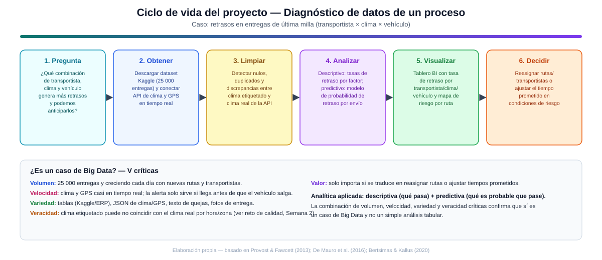

# Actividad Calificable · Corte 1 — Diagnóstico de datos de un proceso

**Programa:** Ingeniería Industrial · **Asignatura:** Ciencia de Datos
**Semana:** 4 del corte · **Entrega:** Individual, por GitHub (fork del repositorio de la clase) · **Valor:** 5.0
**Tema:** Logística — Retrasos en entregas de última milla (continuación de las Semanas 1 a 4)

---

## 1. Problema y pregunta de datos

**Proceso elegido:** la operación de última milla de un servicio de logística/mensajería, es decir, el tramo final en el que un paquete sale de un centro de distribución y llega hasta la puerta del cliente.

**Pregunta de datos:**

> ¿Qué combinación de transportista, condición climática y tipo de vehículo genera más retrasos en las entregas de última milla, y es posible anticipar esos retrasos antes de que ocurran?

Esta pregunta es clara y relevante para el negocio porque: (a) delimita variables concretas y medibles (transportista, clima, vehículo), (b) apunta a un fenómeno con impacto económico y reputacional directo (el incumplimiento del tiempo de entrega prometido), y (c) tiene un horizonte de uso explícito —anticipar, no solo describir—, lo que obliga a que el diagnóstico de datos considere desde el inicio tanto la fase descriptiva como la predictiva del análisis.

## 2. Inventario de datos

Se identifican **seis fuentes/campos de datos** relevantes para responder la pregunta, clasificados según su nivel de estructura:

| # | Fuente / campo | Ejemplo de contenido | Tipo | Justificación de la clasificación |
|---|---|---|---|---|
| 1 | Dataset histórico de entregas ([Delivery Logistics Dataset – Kaggle](https://www.kaggle.com/datasets/kundanbedmutha/delivery-logistics-dataset-india-multi-partner)) | Transportista, distancia, tiempo estimado/real, estado de la entrega | **Estructurado** | Tabla con filas y columnas fijas (CSV), esquema predefinido tipo base de datos relacional |
| 2 | API de clima en tiempo real | JSON con temperatura, precipitación y viento por hora y zona | **Semiestructurado** | Tiene etiquetas (`{"temp":..., "condicion":...}`) pero el esquema puede variar entre proveedores y no está normalizado en tabla |
| 3 | Telemetría GPS del vehículo | Flujo de eventos de ubicación y velocidad enviados por la app del transportista | **Semiestructurado** | Registros tipo log/JSON con marca de tiempo, llegan como flujo continuo (streaming), sin tabla relacional fija |
| 4 | Sistema ERP / facturación del operador | Tablas de órdenes de envío, costos, zonas de cobertura, turnos del conductor | **Estructurado** | Base de datos transaccional con relaciones definidas (cliente–pedido–transportista) |
| 5 | Encuestas y comentarios de clientes post-entrega | Texto libre: *"el paquete llegó mojado y con dos horas de retraso"* | **No estructurado** | Lenguaje natural sin esquema ni campos delimitados; requiere procesamiento de texto para explotarse |
| 6 | Fotos de evidencia de entrega (prueba de entrega / POD) | Imagen tomada por el transportista al momento de entregar el paquete | **No estructurado** | Archivo binario (imagen) sin estructura tabular ni campos asociados por sí solo |

El inventario cubre deliberadamente los tres tipos de estructura, porque la pregunta de datos no puede responderse solo con la tabla histórica (fuente 1): el componente de anticipación exige clima y ubicación casi en tiempo real (fuentes 2 y 3), y una evaluación completa de causas de retraso eventualmente se apoya también en evidencia cualitativa (fuentes 5 y 6).

## 3. Tipo de analítica y justificación de Big Data

**Tipo de analítica aplicada:** se combinan **analítica descriptiva** y **analítica predictiva**, dos de los cuatro niveles del espectro descriptiva → diagnóstica → predictiva → prescriptiva:

- **Descriptiva** ("¿qué está pasando?"): cuantificar las tasas de retraso históricas cruzando transportista × clima × tipo de vehículo (fuente 1), para identificar las combinaciones más problemáticas.
- **Predictiva** ("¿qué es probable que pase?"): entrenar un modelo de clasificación que estime la probabilidad de retraso de un envío nuevo a partir de su transportista, clima esperado y vehículo asignado, usando la etiqueta histórica de retraso como variable objetivo.

No se aborda todavía la analítica prescriptiva (recomendar automáticamente la reasignación óptima) porque, siguiendo la lógica de madurez del proceso, primero es necesario validar que el modelo predictivo funciona razonablemente bien; intentar prescribir sin un diagnóstico predictivo sólido produciría recomendaciones poco confiables (Bertsimas & Kallus, 2020).

**¿Es un caso de Big Data? Sí, justificado con las V:**

- **Volumen** — 25 000 entregas históricas y creciendo cada día con nuevas rutas y transportistas; supera lo manejable en una hoja de cálculo simple.
- **Velocidad** — el clima y el GPS deben procesarse casi en tiempo real (fuentes 2 y 3): una alerta de riesgo que llega después de que el vehículo salió no permite tomar ninguna acción.
- **Variedad** — coexisten tablas relacionales (fuentes 1 y 4), datos semiestructurados en streaming (fuentes 2 y 3) y datos no estructurados (fuentes 5 y 6), lo que exige técnicas distintas de procesamiento para cada tipo.
- **Veracidad** — el clima etiquetado en el histórico puede no coincidir con el clima real de la API para la misma hora y zona, lo que puede distorsionar tanto el análisis descriptivo como el modelo predictivo si no se valida.

De acuerdo con la definición formal de De Mauro, Greco y Grimaldi (2016), big data es el activo de información caracterizado por un volumen, velocidad y variedad tan altos que requiere tecnología y métodos analíticos específicos para transformarlo en valor; dado que este caso presenta las cuatro V críticas anteriores —no solo volumen—, se confirma que corresponde a un problema de big data y no a un análisis tabular convencional.

## 4. Ciclo de vida del proyecto aplicado al caso

El diagrama `diagnostico-datos-logistica.svg` (incluido junto a este documento) recorre las seis etapas del ciclo de vida —**pregunta → obtener → limpiar → analizar → visualizar → decidir**— instanciadas en el caso de última milla:

1. **Pregunta** — la formulada en la sección 1.
2. **Obtener** — descargar el histórico de Kaggle y conectar las API de clima y GPS en tiempo real.
3. **Limpiar** — detectar nulos, duplicados y, en particular, discrepancias entre el clima etiquetado en el histórico y el clima real reportado por la API para la misma hora/zona.
4. **Analizar** — calcular las tasas de retraso descriptivas por combinación de factores y entrenar el modelo predictivo de probabilidad de retraso.
5. **Visualizar** — construir un tablero de BI con la tasa de retraso por transportista/clima/vehículo y un mapa de riesgo por ruta.
6. **Decidir** — reasignar rutas o transportistas, o ajustar el tiempo de entrega prometido al cliente, en las condiciones identificadas como de mayor riesgo (la decisión esperada definida desde la Semana 1 de este proyecto).

Este recorrido evidencia por qué el proyecto no puede saltarse etapas: sin una limpieza cuidadosa de la veracidad del clima (etapa 3), tanto el análisis (etapa 4) como la decisión final (etapa 6) quedarían construidos sobre una base de datos poco confiable, en línea con la relación entre calidad de datos y confiabilidad de las decisiones basadas en datos discutida por Provost y Fawcett (2013).

---

## Problem & data

*(English section, required by the assignment — minimum 5 sentences)*

This project addresses the last-mile delivery stage of a logistics operation, where packages travel from a distribution center to the final customer and delivery delays remain a persistent operational problem. The core business question is which combination of carrier, weather condition, and vehicle type produces the highest rate of delivery delays, and whether those delays can be anticipated before they happen. To answer this question, the project needs a historical delivery dataset with carrier, distance, estimated versus actual delivery time, and delay status, complemented by near-real-time weather and GPS data, along with operational records from the logistics ERP and qualitative evidence such as customer complaints and proof-of-delivery photos. These data sources span all three structural types — structured tables, semi-structured JSON streams, and unstructured text and images — which is precisely why this case qualifies as a big data problem rather than a simple tabular analysis. The analytics approach combines descriptive analytics, to quantify historical delay rates across carrier, weather, and vehicle combinations, with predictive analytics, to estimate the probability that a new delivery will be delayed given its assigned carrier, expected weather, and vehicle type. Ultimately, the value of this diagnostic lies in enabling a concrete operational decision: reassigning routes or carriers, or proactively adjusting the delivery time promised to the customer, whenever the predicted risk of delay is high.

---

## 5. Marco de referencia y conceptos

### 5.1 Ciencia de datos como apoyo a decisiones basadas en datos

Provost y Fawcett (2013) sostienen que el valor de la ciencia de datos está en convertir datos en decisiones mejor informadas, y que ese valor depende críticamente de la calidad y confiabilidad de los datos usados, no solo del volumen disponible. Este principio sustenta directamente la sección 4 de este diagnóstico: la etapa de limpieza no es un paso accesorio, sino la condición para que el análisis y la decisión final sean confiables.

### 5.2 Una definición formal de Big Data

De Mauro, Greco y Grimaldi (2016), a partir de una revisión sistemática de la literatura, definen big data como el activo de información caracterizado por un volumen, velocidad y variedad tan altos que requiere tecnología y métodos analíticos específicos para transformarlo en valor. Esta definición es la que se usa en la sección 3 para justificar, con evidencia propia del caso, por qué el diagnóstico de última milla corresponde efectivamente a un problema de big data.

### 5.3 De la analítica predictiva a la prescriptiva

Bertsimas y Kallus (2020) muestran que el salto de analítica predictiva a prescriptiva no consiste simplemente en extender el mismo modelo, sino en combinar la estimación de un resultado futuro con un problema de decisión/optimización bajo incertidumbre. Este argumento respalda la decisión, en la sección 3, de limitar el alcance de este diagnóstico a la analítica descriptiva y predictiva, dejando la prescripción automática de reasignaciones como una fase posterior del proyecto.

---

## 6. Verificación frente a la rúbrica

| Criterio de la rúbrica | Pts | Cómo se cumple en este documento |
|---|---|---|
| Problema + pregunta de datos (clara y relevante) | 1.0 | Sección 1: proceso concreto (última milla) + pregunta de datos delimitada, medible y con horizonte de anticipación explícito |
| Inventario (6+ con tipos, correcto y completo) | 1.5 | Sección 2: tabla con **6 fuentes**, cubriendo estructurado, semiestructurado y no estructurado, cada una con justificación propia |
| Analítica + ¿Big Data? (V, justificado) | 1.5 | Sección 3: tipo de analítica (descriptiva + predictiva) justificado, y las 4 V críticas (volumen, velocidad, variedad, veracidad) argumentadas con evidencia del caso, no solo enumeradas |
| Ciclo de vida + "Problem & data" (EN, coherente) | 1.0 | Sección 4: las 6 etapas aplicadas al caso + diagrama SVG; sección "Problem & data" en inglés con 5 oraciones que cubren problema, datos necesarios y tipo de analítica |
| **Total** | **5.0** | |

---

## Referencias

- CORHUILA. (2026). *Ciencia de Datos · Semanas 1–4 · Fundamentos de Ciencia de Datos y Big Data* [Material de curso, OVA]. Corporación Universitaria del Huila. https://code-corhuila.github.io/ova-web/2026-B/ciencia-datos/
- Bertsimas, D., & Kallus, N. (2020). From predictive to prescriptive analytics. *Management Science, 66*(3), 1025–1044. https://doi.org/10.1287/mnsc.2018.3253
- De Mauro, A., Greco, M., & Grimaldi, M. (2016). A formal definition of Big Data based on its essential features. *Library Review, 65*(3), 122–135. https://doi.org/10.1108/LR-06-2015-0061
- Provost, F., & Fawcett, T. (2013). Data science and its relationship to big data and data-driven decision making. *Big Data, 1*(1), 51–59. https://doi.org/10.1089/big.2013.1508
