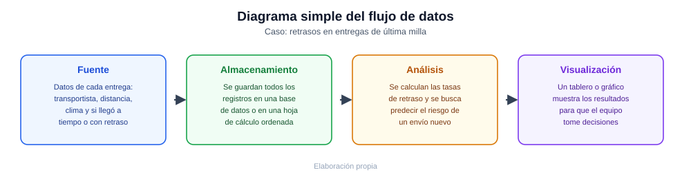

# Parcial Práctico · Corte 1

**Asignatura:** Ciencia de Datos · **Modalidad:** Individual · **Valor:** 2.5 puntos (50 % del parcial)

---

## El caso que elegí

Voy a trabajar con un caso sencillo: una empresa de mensajería que entrega paquetes a domicilio (lo que se conoce como "última milla") y que, en algunos envíos, no logra cumplir el tiempo de entrega prometido al cliente. La empresa quiere entender mejor por qué pasa esto y, si es posible, adelantarse al problema.

## 1. Cuatro tipos de datos y su clasificación

Para entender por qué se retrasan las entregas, la empresa necesitaría mirar distintos tipos de información. Aquí van cuatro ejemplos, explicados de forma simple:

| Dato | ¿En qué consiste? | Tipo | ¿Por qué es de ese tipo? |
|---|---|---|---|
| Registro de entregas | Una tabla con el transportista, la distancia, la hora de salida y si la entrega llegó a tiempo o no | **Estructurado** | Es una tabla ordenada, con columnas fijas, como una hoja de Excel o una base de datos |
| Datos del clima | La información que entrega una app de clima sobre lluvia, temperatura o viento en el momento del envío | **Semiestructurado** | Tiene cierto orden (etiquetas como "temperatura" o "lluvia"), pero no viene en una tabla fija; suele llegar en un formato tipo lista de datos (JSON) |
| Ubicación del vehículo (GPS) | La posición del repartidor mientras hace la entrega, actualizada cada pocos segundos | **Semiestructurado** | Igual que el clima, llega como un flujo continuo de datos con cierta estructura, pero no está organizado en una tabla tradicional |
| Comentarios de los clientes | Lo que el cliente escribe después de recibir su pedido, por ejemplo: "llegó tarde y el paquete estaba mojado" | **No estructurado** | Es texto libre, escrito como el cliente quiera, sin ningún formato ni campo fijo |

En resumen: el registro de entregas es un dato estructurado porque está en tabla; el clima y el GPS son semiestructurados porque tienen algo de organización pero no son tablas; y los comentarios de los clientes son no estructurados porque son simplemente texto libre.

## 2. Una pregunta descriptiva y una pregunta predictiva

- **Pregunta descriptiva** (mira hacia el pasado, para entender qué ha pasado):
  > ¿Cuál ha sido, en el último mes, el porcentaje de entregas retrasadas por cada transportista?

- **Pregunta predictiva** (mira hacia el futuro, para anticipar lo que puede pasar):
  > Para un envío que sale hoy, ¿qué tan probable es que llegue tarde, teniendo en cuenta el clima y el transportista asignado?

La diferencia entre las dos es simple: la primera describe algo que ya ocurrió (mirar hacia atrás), y la segunda intenta anticipar algo que todavía no ha pasado (mirar hacia adelante).

## 3. Diagrama del flujo de datos

El siguiente diagrama (`diagrama-parcial-c1.svg`, incluido junto a este documento) muestra, de forma sencilla, cómo se movería la información desde que se genera hasta que alguien la usa para tomar una decisión:

```
Fuente  →  Almacenamiento  →  Análisis  →  Visualización
(datos de   (se guardan en    (se calculan   (un tablero o
cada envío:  una base de       las tasas de    gráfico muestra
transportista, datos o una      retraso y se    los resultados
clima, GPS)   hoja ordenada)    predice el      para decidir)
                                riesgo)
```



Explicado en palabras simples: primero se recogen los datos de cada entrega (fuente); luego esos datos se guardan de forma ordenada (almacenamiento); después se revisan y se calculan cosas como el porcentaje de retrasos o la probabilidad de que un nuevo envío se retrase (análisis); y por último, esos resultados se muestran en un tablero o un gráfico fácil de leer, para que el equipo de logística pueda decidir, por ejemplo, cambiar de transportista en ciertas condiciones de clima (visualización).

## 4. Descriptive analytics vs. predictive analytics (en inglés)

Descriptive analytics looks at past delivery data to show what already happened, such as how many packages arrived late last month. Predictive analytics, on the other hand, uses that same historical data to estimate what is likely to happen in the future, such as how likely a new delivery is to be late.

---

**Nota:** este ejercicio usa el mismo caso de entregas de última milla trabajado a lo largo del corte, simplificado según lo que pide este parcial.
