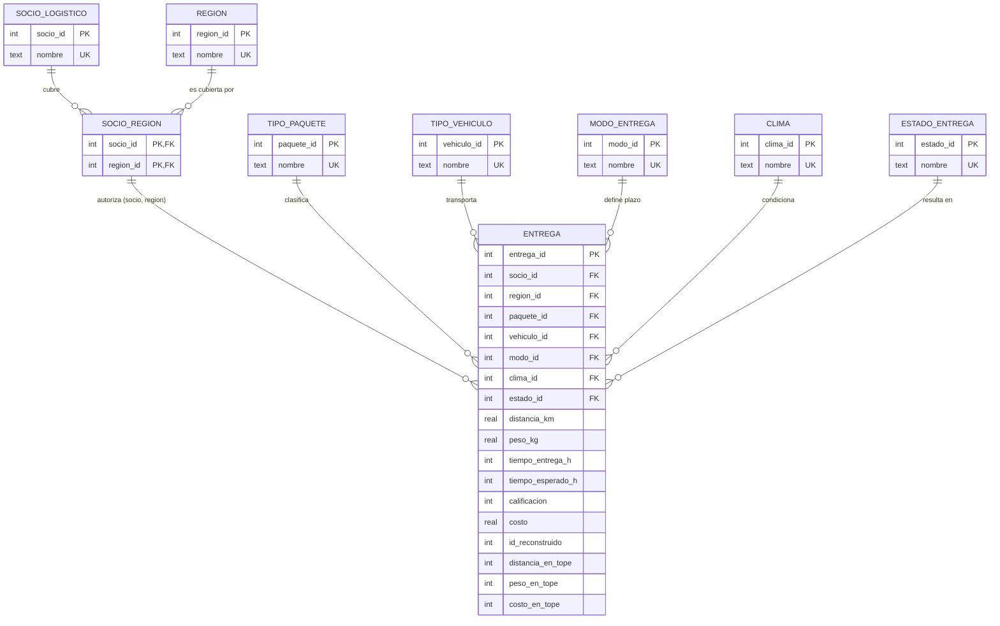

# ERD en Mermaid (se renderiza directamente en GitHub)

```mermaid
erDiagram
    SOCIO_LOGISTICO ||--o{ SOCIO_REGION : "cubre"
    REGION ||--o{ SOCIO_REGION : "es cubierta por"
    SOCIO_REGION ||--o{ ENTREGA : "autoriza (socio, region)"
    TIPO_PAQUETE ||--o{ ENTREGA : "clasifica"
    TIPO_VEHICULO ||--o{ ENTREGA : "transporta"
    MODO_ENTREGA ||--o{ ENTREGA : "define plazo"
    CLIMA ||--o{ ENTREGA : "condiciona"
    ESTADO_ENTREGA ||--o{ ENTREGA : "resulta en"

    SOCIO_LOGISTICO { int socio_id PK
        text nombre UK }
    REGION { int region_id PK
        text nombre UK }
    SOCIO_REGION { int socio_id PK,FK
        int region_id PK,FK }
    TIPO_PAQUETE { int paquete_id PK
        text nombre UK }
    TIPO_VEHICULO { int vehiculo_id PK
        text nombre UK }
    MODO_ENTREGA { int modo_id PK
        text nombre UK }
    CLIMA { int clima_id PK
        text nombre UK }
    ESTADO_ENTREGA { int estado_id PK
        text nombre UK }
    ENTREGA {
        int entrega_id PK
        int socio_id FK
        int region_id FK
        int paquete_id FK
        int vehiculo_id FK
        int modo_id FK
        int clima_id FK
        int estado_id FK
        real distancia_km
        real peso_kg
        int tiempo_entrega_h
        int tiempo_esperado_h
        int calificacion
        real costo
        int id_reconstruido
        int distancia_en_tope
        int peso_en_tope
        int costo_en_tope
    }
```
