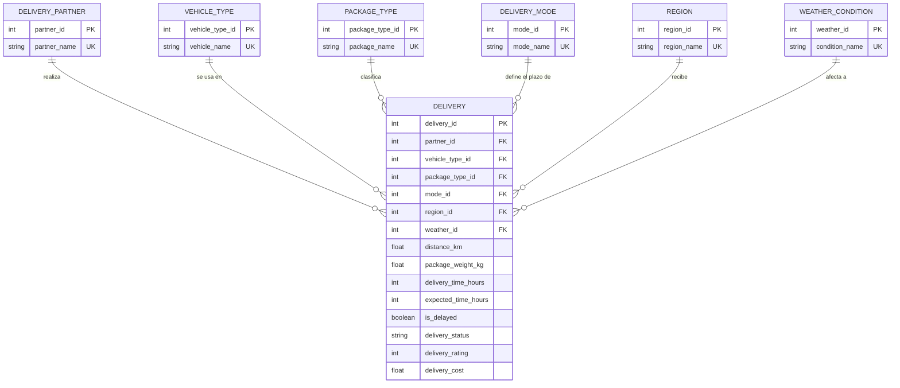
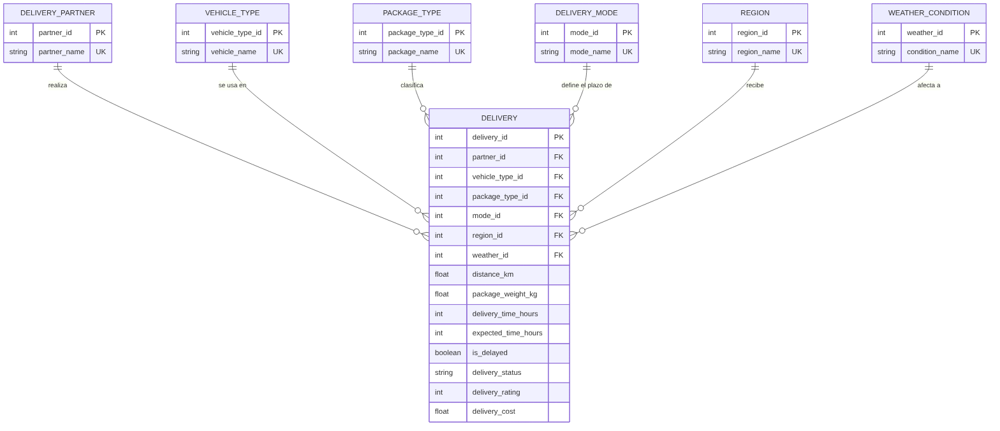

# Actividad Calificable · Corte 2 — Modelo, consulta y limpieza de datos

**Programa:** Ingeniería Industrial · **Asignatura:** Ciencia de Datos
**Semana:** 4 del corte (semana 9) · **Entrega:** Individual, por GitHub · **Valor:** 5.0
**Caso:** Logística — Retrasos en entregas de última milla (continuación del Corte 1)

**Camila Alejandra Salas Gracia**

Todo lo de esta carpeta se reproduce con un solo comando: `python limpieza_y_consultas.py`.

| Archivo | Contenido |
|---|---|
| `erd.mmd` / `erd.svg` / `erd.png` | ERD (Mermaid y sus imágenes) |
| `schema.sql` | Modelo relacional (DDL SQLite) derivado del ERD |
| `limpieza_y_consultas.py` | Carga, limpieza, antes/después y las 2 consultas (SQL y pandas) |
| `data/Delivery_Logistics.csv` | Dataset crudo (25 000 entregas) |
| `data/Delivery_Logistics_clean.csv` | Dataset limpio |
| `reports/before_after.md` | Reporte antes/después generado por el script |
| `reports/query_results.md` | Resultados de las consultas generados por el script |

---

## 1. ERD — Modelo de datos del caso

El dataset original es una sola tabla ancha. Para el modelo la separo en **una tabla de hechos (`DELIVERY`) y seis catálogos**, de modo que cada transportista, vehículo, tipo de paquete, modo de entrega, región y condición climática se guarde una sola vez (sin repetir texto en 25 000 filas y sin errores de escritura).





### Cardinalidades

| Relación | Cardinalidad | Lectura |
|---|---|---|
| `DELIVERY_PARTNER` – `DELIVERY` | 1 : N | Un transportista realiza muchas entregas; cada entrega la hace exactamente un transportista |
| `VEHICLE_TYPE` – `DELIVERY` | 1 : N | Un tipo de vehículo se usa en muchas entregas; cada entrega usa un solo tipo |
| `PACKAGE_TYPE` – `DELIVERY` | 1 : N | Un tipo de paquete aparece en muchas entregas; cada entrega lleva un solo tipo |
| `DELIVERY_MODE` – `DELIVERY` | 1 : N | Un modo (express, same day, two day, standard) define el plazo de muchas entregas |
| `REGION` – `DELIVERY` | 1 : N | Una región recibe muchas entregas; cada entrega va a una sola región |
| `WEATHER_CONDITION` – `DELIVERY` | 1 : N | Una condición climática se presenta en muchas entregas; cada entrega registra una sola |

Las relaciones son "uno a muchos" con participación opcional del lado 1 (un catálogo puede existir sin entregas) y obligatoria del lado N (toda entrega tiene los seis catálogos: las FK son `NOT NULL`). Además, `DELIVERY` actúa como **tabla asociativa** que resuelve relaciones muchos-a-muchos entre catálogos: por ejemplo, un transportista opera en varias regiones y una región es atendida por varios transportistas (N : M `PARTNER`–`REGION`, resuelta a través de `DELIVERY`). El DDL con claves primarias, foráneas y restricciones `CHECK` está en `schema.sql`, y el script lo usa de verdad para cargar los datos limpios en SQLite y correr las consultas SQL.

---

## 2. Dataset y limpieza (antes / después)

**Dataset:** *Delivery Logistics Dataset (India – Multi-Partner)*, de Kaggle, el mismo del Corte 1. Son **25 000 entregas × 15 columnas**: transportista, tipo de paquete, vehículo, modo de entrega, región, clima, distancia, peso, tiempo real y esperado, bandera de retraso, estado, calificación y costo.

### Diagnóstico y resultado

| Métrica | Antes | Después |
|---|---|---|
| Filas | 25 000 | 25 000 |
| Columnas | 15 | 18 (se agregan `delay_hours`, `boundary_value_flag`; `delayed` pasa a `is_delayed`) |
| **Nulos totales** | **0** | 0 |
| **Filas duplicadas** (exactas / ignorando el ID) | **0 / 0** | 0 / 0 |
| `delivery_id` repetidos | 498 valores repetidos (500 filas con ID no entero: `250.99` y `24750.01`) | 0 |
| Columnas de tiempo | Fechas `1970-01-01 00:00:00.00000000N` (las horas quedaron como nanosegundos) | Enteros (horas) |
| `delayed` | texto `yes`/`no` | booleano `is_delayed` |
| Categorías sin normalizar (`blue dart`, `ev van`, `same day`…) | 34 789 celdas | 0 (`blue_dart`, `ev_van`, `same_day`) |
| Decimales de `delivery_cost` | hasta 4 | 2 |
| Memoria en pandas | 16.0 MB | 1.1 MB |

Qué se hizo, paso por paso (todo está en `limpieza_y_consultas.py` y en `reports/before_after.md`):

1. **Nulos.** Se contaron por columna: **no hay ninguno**, así que no se imputó ni se eliminó ninguna fila. Aun así el script deja implementada la regla (eliminar si falta la etiqueta o los tiempos; mediana en numéricas; `unknown` en categóricas) para que funcione igual si llega un archivo con nulos.
2. **Duplicados.** Se buscaron filas idénticas, con y sin `delivery_id`: **0 duplicados**, no se eliminó ninguna.
3. **`delivery_id` corrupto.** Las primeras 250 filas traen `250.99` y las últimas 250 traen `24750.01`. Las 24 500 filas del medio son 251…24750 y coinciden exactamente con la posición en el archivo, así que el ID se reconstruyó como 1…25 000 (el script verifica esa coincidencia con un `assert`).
4. **Tipos.** Tiempos de fecha a entero de horas; `yes`/`no` a booleano; `delivery_rating` a `int8`; categóricas a `category`; `delivery_id` a entero.
5. **Formatos.** Texto en minúsculas, sin espacios sobrantes y en `snake_case`; costo a 2 decimales.
6. **Valores en los extremos.** El costo `95.6674` y el `1632.7206` aparecen exactamente 250 veces cada uno (1 % de las filas) y con 4 decimales; la distancia y el peso también se amontonan en su mínimo y máximo. Parece que el dataset fue "topado" en el 1 % inferior y superior. No lo puedo demostrar, así que **no se eliminan**: se marcan en `boundary_value_flag` (1 370 filas) para poder hacer análisis de sensibilidad.
7. **Consistencia.** `is_delayed = True` incluye las entregas `failed` (1 328), y hay 963 entregas con estado `delayed` cuyo tiempo real no supera el esperado. Se conservan tal cual, porque son la etiqueta oficial del dataset, y se documentan.

---

## 3. Dos preguntas con consultas

Las dos consultas están escritas en **SQL** (sobre el modelo del ERD, en SQLite) y en **pandas**; el script comprueba que ambas den exactamente el mismo resultado.

Antes de consultar revisé algo importante: los modos `standard` y `two_day` casi nunca se retrasan (0.0 % y 0.4 %), porque su plazo esperado (24 y 16 horas) es muy holgado. Si se mezclan con los demás, el efecto del clima y del transportista se diluye. Por eso ambas preguntas filtran a los modos de plazo corto (`express` y `same_day`), que son donde realmente ocurren los retrasos.

### Q1 — ¿Qué condición climática produce más retrasos en entregas express y same day?

```sql
SELECT w.condition_name AS weather, COUNT(*) AS deliveries,
       SUM(d.is_delayed) AS delayed,
       ROUND(100.0 * AVG(d.is_delayed), 1) AS delay_rate_pct
FROM delivery d
JOIN weather_condition w ON w.weather_id = d.weather_id
JOIN delivery_mode m     ON m.mode_id    = d.mode_id
WHERE m.mode_name IN ('express', 'same_day')      -- filtro
GROUP BY w.condition_name                         -- agregación
ORDER BY delay_rate_pct DESC;
```

```python
(df[df.delivery_mode.isin(["express", "same_day"])]
   .groupby("weather_condition")["is_delayed"].agg(["size", "sum", "mean"]))
```

| Clima | Entregas | Retrasadas | % retraso |
|---|---|---|---|
| stormy | 2 081 | 1 717 | **82.5** |
| rainy | 2 062 | 1 555 | 75.4 |
| foggy | 2 068 | 1 278 | 61.8 |
| clear | 2 122 | 719 | 33.9 |
| hot | 2 092 | 707 | 33.8 |
| cold | 2 087 | 666 | 31.9 |

**Hallazgo:** el clima sí importa, y mucho. Con tormenta se retrasan 8 de cada 10 entregas de plazo corto, con lluvia 3 de cada 4 y con niebla 6 de cada 10, frente a cerca de 1 de cada 3 en clima despejado, caluroso o frío (esos tres son prácticamente iguales entre sí). La prueba chi-cuadrado confirma que las diferencias no son casualidad (p < 0.001). Operativamente, el clima adverso (`stormy`, `rainy`, `foggy`) lleva el riesgo de retraso a entre casi el doble y 2.5 veces el del clima despejado, y es ahí donde convendría ajustar el tiempo prometido al cliente.

### Q2 — En lluvia o tormenta, ¿qué transportista se retrasa más?

```sql
SELECT p.partner_name AS carrier, COUNT(*) AS deliveries,
       SUM(d.is_delayed) AS delayed,
       ROUND(100.0 * AVG(d.is_delayed), 1) AS delay_rate_pct
FROM delivery d
JOIN delivery_partner p  ON p.partner_id = d.partner_id
JOIN delivery_mode m     ON m.mode_id    = d.mode_id
JOIN weather_condition w ON w.weather_id = d.weather_id
WHERE m.mode_name IN ('express', 'same_day')      -- filtro 1
  AND w.condition_name IN ('rainy', 'stormy')     -- filtro 2
GROUP BY p.partner_name                           -- agregación
ORDER BY delay_rate_pct DESC;
```

| Transportista | Entregas | Retrasadas | % retraso |
|---|---|---|---|
| ekart | 460 | 378 | 82.2 |
| shadowfax | 440 | 354 | 80.5 |
| delhivery | 442 | 354 | 80.1 |
| ecom_express | 451 | 358 | 79.4 |
| blue_dart | 466 | 368 | 79.0 |
| xpressbees | 502 | 394 | 78.5 |
| fedex | 463 | 363 | 78.4 |
| dhl | 461 | 354 | 76.8 |
| amazon_logistics | 458 | 349 | 76.2 |

**Hallazgo:** en condiciones adversas ningún transportista se distingue. Todos quedan entre 76 % y 82 %, y la diferencia entre el mejor (Amazon Logistics) y el peor (Ekart) son 6 puntos con unas 450 entregas por transportista; la prueba chi-cuadrado no la distingue del azar (p = 0.49). Es decir, la causa del retraso está en el **clima y el modo de entrega, no en quién transporta**, algo coherente con el riesgo ético del Corte 1: evaluar o penalizar a un transportista por estas cifras sería injusto. (Una revisión aparte por tipo de vehículo, en esas mismas condiciones, tampoco muestra diferencias relevantes: 77 %–80 %, p = 0.76.)

**Limitación:** el dataset parece simulado (tasas casi uniformes entre transportistas, vehículos y regiones), por lo que estos hallazgos describen estos datos y no deben generalizarse a una operación real sin validar.

---

## Data & cleaning

*(English section, required by the assignment — minimum 5 sentences)*

The dataset is the "Delivery Logistics Dataset (India – Multi-Partner)" from Kaggle, which contains 25,000 last-mile deliveries described by 15 columns such as carrier, vehicle type, delivery mode, region, weather, distance, expected and actual delivery time, delay flag, status, rating and cost. I first counted missing values and duplicated rows and found none, so no rows had to be imputed or removed, but I kept the imputation and de-duplication rules in the script so it also works on dirtier files. The real quality problems were different: 500 corrupted delivery IDs (the repeated values 250.99 and 24750.01), delivery and expected times stored as 1970 timestamps instead of hours, categorical labels with spaces and inconsistent formats, and cost values with extra decimals. I rebuilt the IDs from the row order, converted the timestamps into integer hours, turned the yes/no flag into a boolean, normalized all text labels to snake_case, rounded costs to two decimals, and flagged 1,370 rows whose values pile up at the minimum or maximum instead of deleting them. The first question asked which weather condition causes the most delays in express and same-day deliveries, and the answer is stormy weather with an 82.5% delay rate, versus about 32–34% in clear, hot or cold weather. The second question asked which carrier is delayed most often under rain or storm, and the answer is that carriers are statistically indistinguishable (76%–82%, p = 0.49), so weather and delivery mode explain delays far better than the carrier does.

---

## Verificación frente a la rúbrica

| Criterio | Pts | Dónde se cumple |
|---|---|---|
| ERD (entidades/relaciones) | 1.5 | Sección 1: 7 entidades con atributos, PK/FK, cardinalidades 1:N explicadas y N:M resuelta por la tabla asociativa; `schema.sql` lo implementa |
| Limpieza (nulos/dup/tipos/formato) + antes/después | 2.0 | Sección 2 y `reports/before_after.md`: nulos, duplicados, tipos y formatos, con la tabla antes/después |
| 2 consultas + hallazgo | 1.0 | Sección 3: dos consultas con filtro + agregación (SQL y pandas verificados) y un hallazgo para cada una |
| "Data & cleaning" (EN) | 0.5 | Sección en inglés con 6 oraciones: dataset, limpieza y las dos preguntas |

## Referencias

- CORHUILA. (2026). *Ciencia de Datos · Semanas 6 a 9: Modelamiento de datos; Herramientas y lenguajes (SQL, NoSQL, Python); Conexión de datos: APIs, ETL y pipelines; Transformación y calidad de datos* [Material de curso, OVA]. https://code-corhuila.github.io/ova-web/2026-B/ciencia-datos/
- Kundan Bedmutha. *Delivery Logistics Dataset (India – Multi-Partner)* [Conjunto de datos]. Kaggle. https://www.kaggle.com/datasets/kundanbedmutha/delivery-logistics-dataset-india-multi-partner
